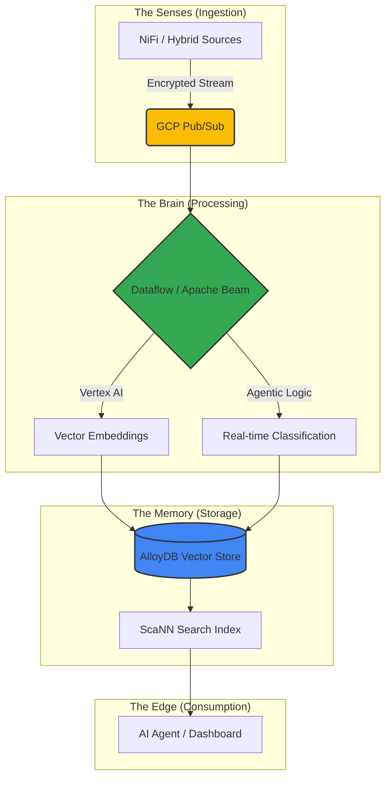

# PoC: The MIA-DoD Agentic-GCP Nervous System 🧠⚡

**Strategic Intelligent Infrastructure for Secure, Real-Time Autonomous Data Orchestration.**

## 📋 Overview
The **MIA-DoD** (Managed Intelligence Architecture) project is the 2.0 evolution of the Agentic Data Nervous System. It transitions a local prototype into a **FedRAMP-Hardened** cloud-native ecosystem. This system acts as a resilient, self-healing "nervous system" for sensitive telemetry, utilizing **AlloyDB’s** ScaNN technology for sub-second vector search and **Google Dataflow** for autonomous processing.

---

## 🚀 The Architecture
The system follows a "Sense-Process-Remember" pattern, moving data from hybrid ingestion points into an AI-augmented relational memory.



## 📂 Repository Structure

```text
mia-dod-nervous-system/
├── terraform/          # 🏗️ IaC: FedRAMP-High project hardening
│   ├── modules/        # Reusable security & DB components
│   ├── main.tf         # Primary orchestrator
│   └── variables.tf    # Input definitions
├── ingestion/          # 📡 Senses: NiFi flows & Pub/Sub schemas
├── pipeline/           # 🧠 Brain: Dataflow / Apache Beam (Python)
│   ├── src/            # Core transformation logic
│   └── setup.py        # Worker dependency configuration
├── database/           # 💾 Memory: AlloyDB / PostgreSQL ScaNN Schema
│   ├── migrations/     # Versioned schema changes
│   └── schema/         # Initial ScaNN & pgvector setup
├── agent/              # 🤖 Agent: AI Reasoning & Recall Logic
├── docs/               # 📜 Compliance: Security & FedRAMP logs
├── .env.example        # 🔑 Security: Environment template
└── README.md           # 📖 Roadmap & Documentation
```

## 🛠️ Tech Stack
Ingestion: 📡 Apache NiFi, GCP Pub/Sub

Stream Processing: 🧠 Google Dataflow (Apache Beam), Python, Vertex AI

Storage: 💾 AlloyDB for PostgreSQL (Columnar Engine + ScaNN), pgvector

Infrastructure: 🏗️ Terraform, Google Cloud Platform (GCP)

Security: 🛡️ VPC Service Controls, CMEK, IAM Workload Identity

## ⚙️  Quick Start

## 1. Environment Setup
Clone the repository and prepare your local secrets:

```Bash
cp .env.example .env
# Edit .env with your GCP project details
```

## 2. Infrastructure Provisioning
```Bash
kcd terraform
terraform init
terraform apply
```
## 3. Launch the Nervous System
Deploy the Dataflow pipeline to begin real-time vectorization:
```Bash
cd pipeline
python main_pipeline.py --project YOUR_PROJECT --runner DataflowRunner
```
## 🛡️ Security & Compliance
This architecture is built specifically for high-sensitivity workloads:

Data Isolation: All traffic is routed via VPC Service Controls to prevent exfiltration.

Zero-Trust Identity: No service account keys are stored; the system uses Short-Lived Tokens.

Auditability: Every "Agentic" decision is logged via Cloud Audit Logs for transparency.

## 👨💻 Author
Alf Baez Architecting Secure & Intelligence C 

